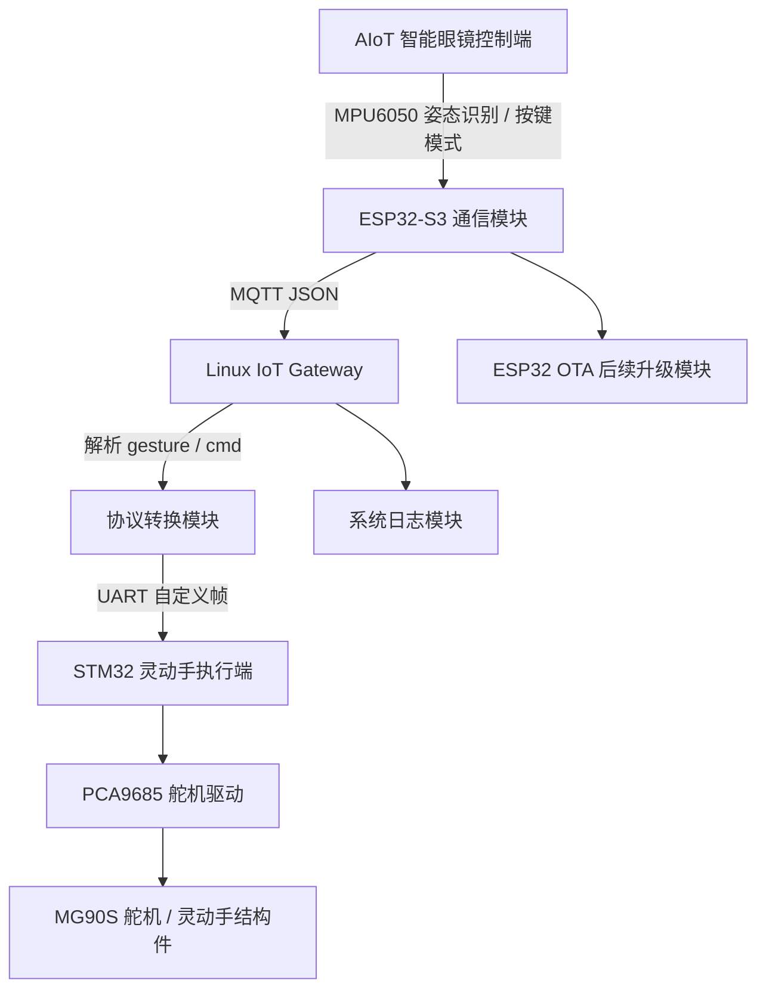

# AIoT 智能眼镜 + 具身智能灵动手控制系统

## 项目简介

本项目是一个面向嵌入式秋招展示的 AIoT + 具身智能控制系统，目标是实现“智能眼镜控制端识别动作，Linux IoT Gateway 解析和转发命令，STM32 灵动手执行端完成动作”的系统级闭环。

项目不是简单的单片机外设实验，而是将可穿戴控制端、Linux 网关、嵌入式执行端和 OTA 升级能力进行整合，模拟真实智能硬件系统中的设备接入、协议转换、边缘控制和执行反馈流程。

## 系统目标

- AIoT 智能眼镜识别用户姿态或按键指令
- ESP32-S3 / STM32 控制端生成手势命令
- 通过 MQTT / UART / WiFi 上传控制数据
- Linux IoT Gateway 接收并解析命令
- 网关将命令转换为灵动手可执行协议
- STM32 灵动手执行端控制舵机完成动作
- 系统记录动作日志
- OTA 作为后续加分升级模块

## 总体架构



## 模块组成

| 模块 | 仓库 | 作用 |
|---|---|---|
| 智能眼镜控制端 | `aiot-smart-glasses` | 姿态识别、OLED 显示、按键模式、手势命令生成 |
| Linux 网关 | `linux-iot-gateway` | MQTT 接收、JSON 解析、命令映射、串口转发、日志记录 |
| 灵动手执行端 | `embodied-robotic-hand` | 舵机控制、动作库、状态机、安全限幅 |
| 系统级工程 | `aiot-embodied-control-system` | 总架构、协议设计、联调记录、演示说明 |
| OTA 模块 | `esp32-mqtt-ota` | WiFi、MQTT、OTA 升级学习与后续扩展 |

## 数据流说明

```text
智能眼镜识别动作
    ↓
生成 JSON 控制命令
    ↓
ESP32-S3 通过 MQTT 发布
    ↓
Linux IoT Gateway 订阅并解析
    ↓
映射为灵动手控制命令
    ↓
UART 自定义协议发送给 STM32
    ↓
STM32 控制 PCA9685 输出 PWM
    ↓
舵机执行 OPEN / GRAB / RELEASE
```

## JSON 数据格式示例

```json
{
  "device": "smart_glasses_01",
  "gesture": "NOD",
  "mode": "CONTROL",
  "cmd": "GRAB"
}
```

## UART 自定义帧格式

```text
0xAA 0x55 CMD LEN DATA CHECKSUM 0x0D 0x0A
```

字段说明：

| 字段 | 作用 |
|---|---|
| 0xAA 0x55 | 帧头 |
| CMD | 控制命令 |
| LEN | 数据长度 |
| DATA | 命令数据 |
| CHECKSUM | 校验值 |
| 0x0D 0x0A | 帧尾 |

## 系统核心动作

| 智能眼镜动作 | 控制命令 | 灵动手动作 |
|---|---|---|
| 点头 NOD | GRAB | 抓取 |
| 左倾 LEFT | OPEN | 张开 |
| 右倾 RIGHT | RELEASE | 释放 |
| 长按按键 | STOP | 停止 / 安全状态 |

## 项目亮点

- 智能眼镜作为可穿戴控制端，不是普通按钮遥控
- Linux IoT Gateway 作为协议转换和日志中心
- 灵动手执行端采用舵机动作库和状态机控制
- 使用 MQTT / UART / JSON / 自定义协议完成多端通信
- 支持 OTA 作为后续升级能力
- 项目具备系统级闭环，适合秋招项目展示

## 当前阶段计划

| 阶段 | 内容 |
|---|---|
| Day5-Day7 | 系统架构、通信协议、周总结 |
| Day8-Day14 | 智能眼镜控制端 MVP |
| Day15-Day21 | 灵动手执行端 MVP |
| Day22-Day28 | MQTT / 网关 / 灵动手系统级联调 |
| Day29-Day30 | 简历 v1 和第一个月复盘 |

## 面试可讲点

- 如何设计一个多端嵌入式系统
- MQTT、UART、自定义协议分别解决什么问题
- Linux 网关为什么作为中间层
- 灵动手状态机如何避免动作混乱
- 舵机控制为什么需要安全限幅
- OTA 在智能硬件中的作用