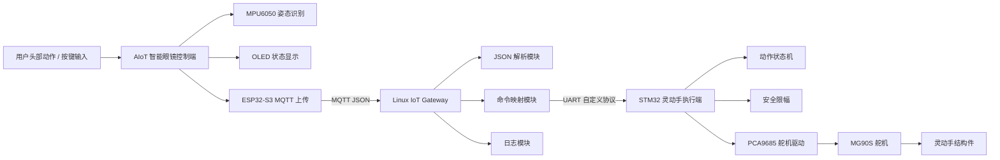

# 系统总架构说明

## 一、系统定位

本系统由智能眼镜控制端、Linux IoT Gateway 和 STM32 灵动手执行端组成，目标是实现从用户动作识别到执行端动作响应的完整闭环。

系统重点不是复杂 AI 算法，而是嵌入式系统工程能力：

- 多端设备协作
- MQTT / UART 协议通信
- Linux 网关解析与转发
- STM32 实时执行控制
- 日志记录与异常处理
- OTA 后续升级能力

## 二、系统架构图



## 三、核心数据链路

```text
用户动作
    ↓
智能眼镜识别手势
    ↓
生成 JSON 命令
    ↓
MQTT 发布
    ↓
Linux 网关订阅
    ↓
解析 gesture / cmd
    ↓
生成 UART 控制帧
    ↓
STM32 接收命令
    ↓
灵动手状态机执行动作
```

## 四、为什么需要 Linux 网关

Linux IoT Gateway 的作用不是简单转发，而是系统中间层：

- 屏蔽智能眼镜和灵动手之间的通信差异
- 将 MQTT JSON 命令转换为 UART 自定义协议
- 记录系统动作日志
- 便于后续接入更多设备
- 便于调试、测试和演示

## 五、系统边界控制

本阶段不做：

- 摄像头视觉识别
- AR 光学显示
- 复杂 AI 推理
- Linux 驱动开发
- 高并发 epoll 服务器
- 复杂机械臂逆运动学

本阶段重点：

- 稳定闭环
- 可展示
- 可写进简历
- 可面试讲清楚